# dbox


## Descripción y contexto
---
> An application box inspired on GOG Galaxy

Básicamente la aplicación busca ser un hub de apps para sea más fácil agrupar y ejecutar varias apps al mismo tiempo, su idea basé es que sea fácil de usar y llamativa de ver.


## Guía de instalación

📥 Descarga la nueva versión de dbox en los Assets de la última reléase [(clic aquí)](https://github.com/Disble/dbox/releases/latest).

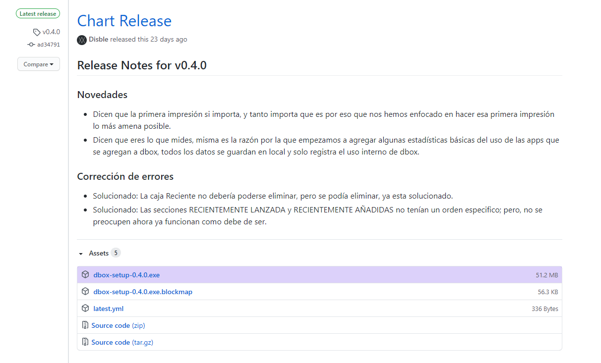

📦 Doble clic para una simple y rápida instalación.

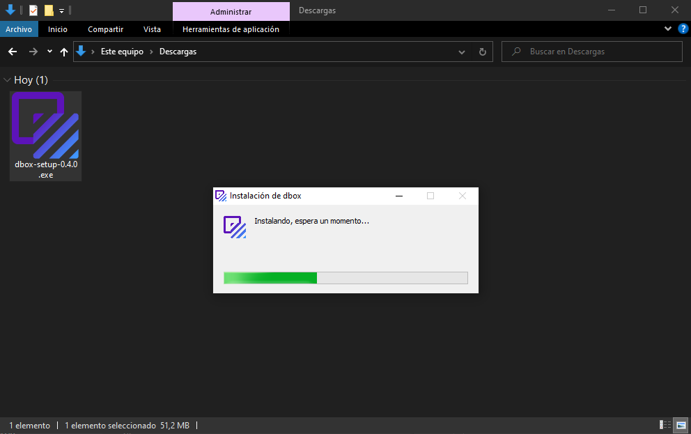

🐙 Y, listo. Ya puedes empezar a utilizar dbox.

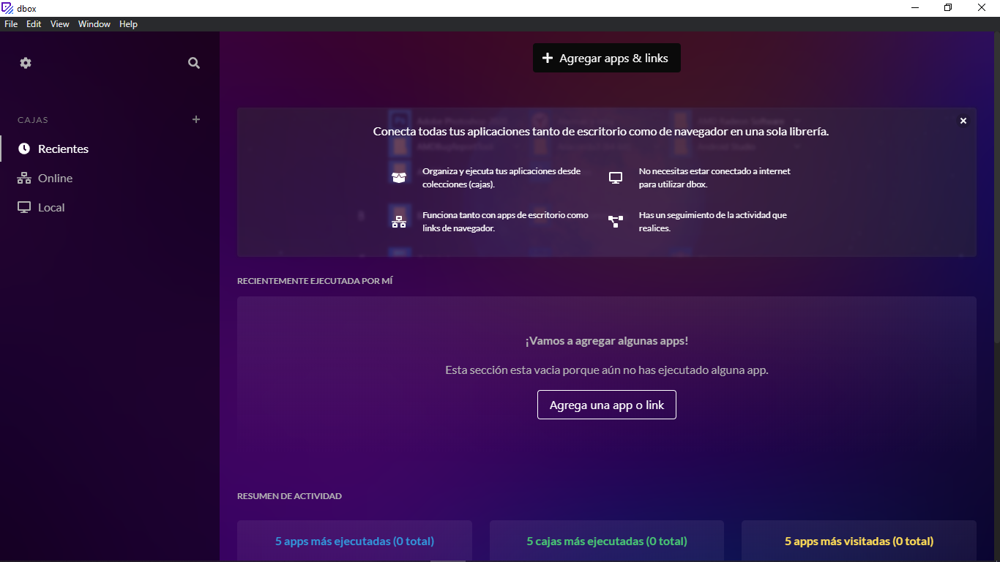

## Guía de usuario
---

> **Vamos a ver algunas de la cosas que puedes hacer con dbox.**

Abre cada app o link con solo un botón.

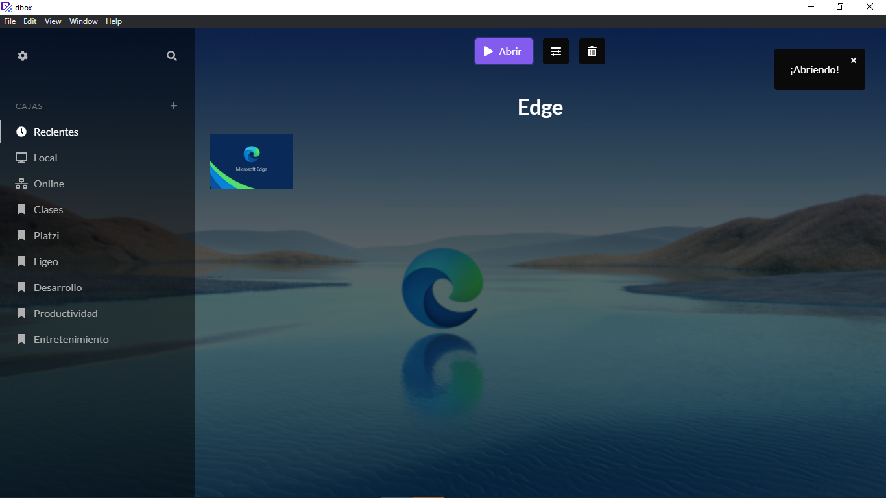

Puedes abrir apps de forma individual o en grupo (llamados cajas).

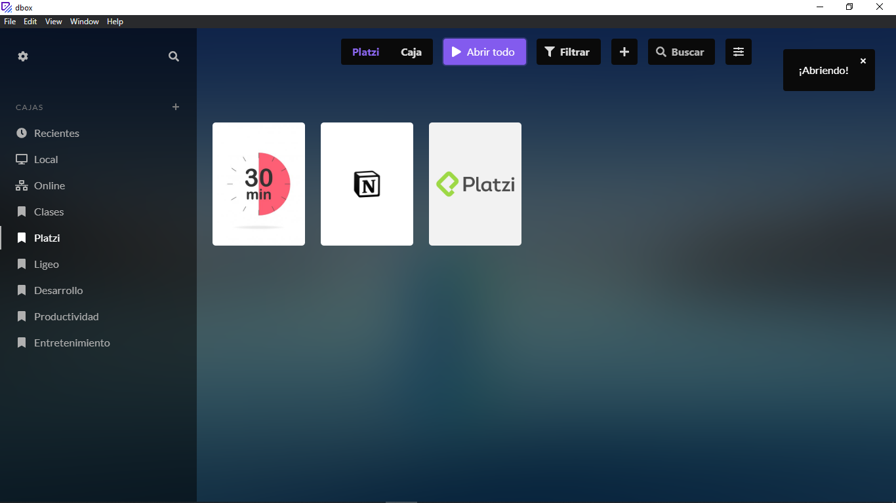

Busca y agrega rápidamente apps en nuestro buscador.

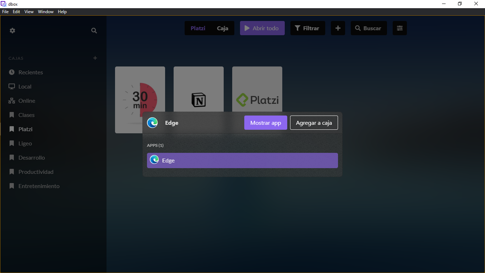

Agrega rápidamente apps de escritorio o urls.

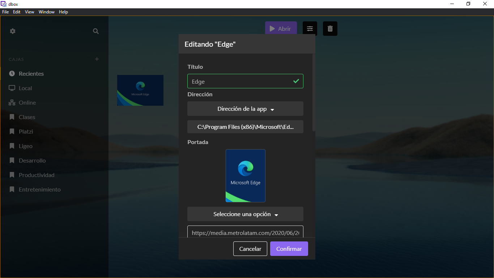

Arrastra imágenes directamente al formulario para agregarlas a la app.

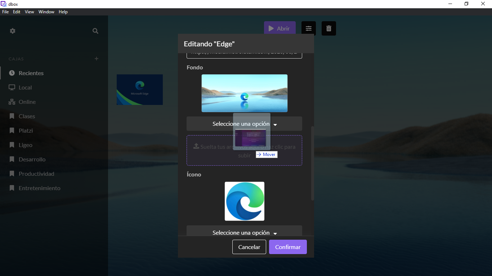

O, usa directamente un link de internet.

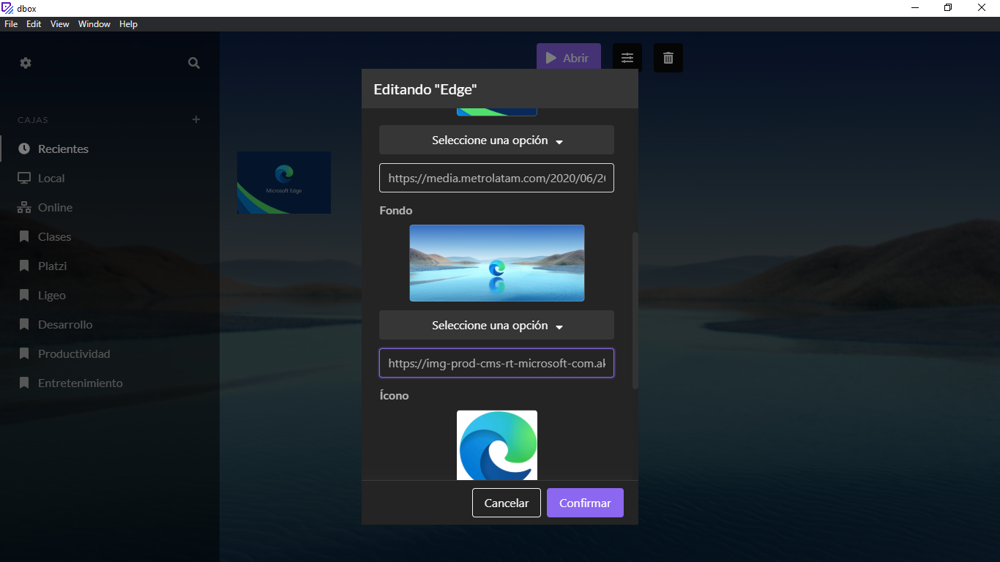

Mira una previsualización rápida de los cambios que estas haciendo.

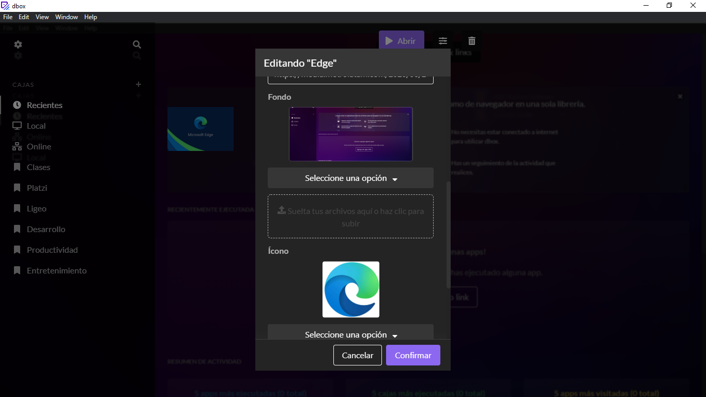


Elimina, abre, edita de forma sencilla con un clic derecho.

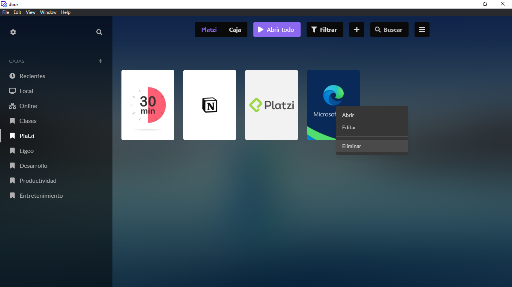


## Guía de instalación (desarrolladores)
---
## Project setup
```
npm install
```

### Compiles and hot-reloads for development
```
npm run electron:serve
```

### Compiles and minifies for production
```
npm run electron:build
```

### Customize configuration
See [Configuration Reference](https://cli.vuejs.org/config/).

## Autor/es
---
Proyecto creado por [@Disble](https://github.com/Disble)

Colaboradores:

- Ícono de dbox creado por [@AndyKingche](https://github.com/AndyKingche)

## Información adicional
---
Cierto día de Julio de 2020 estaba usando una aplicación llamada GOG Galaxy, mientras la usaba note su facilidad y versatilidad al momento de usar. Fue entonces cuando me dije si habría una aplicación de escritorio para apps que cumpla una función parecida.

Así fue como nació la idea de dbox.

## Versiones
---
Las versiones de esta aplicación fueron creadas basándose en [Versionado Semántico](http://semver.org/).

## Licencia
---
Este proyecto está bajo la licencia [MIT](./LICENSE) que esta adjuntado en el mismo.
